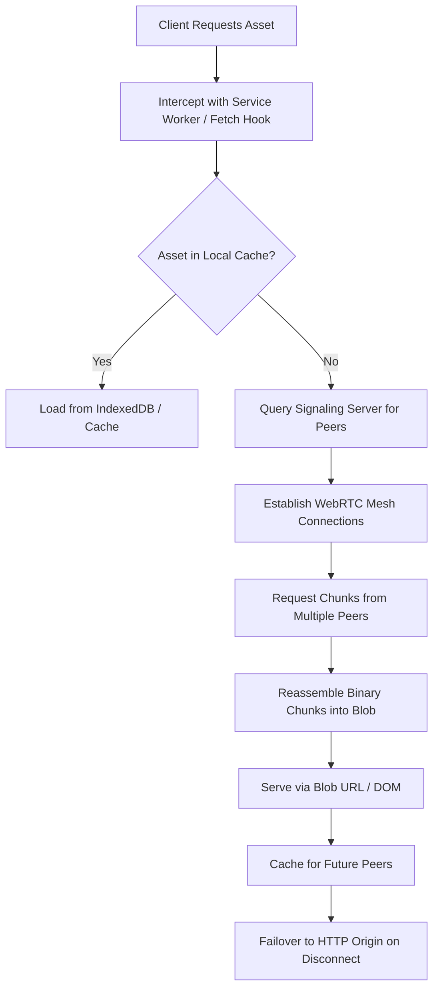

# ShadowCast ⚡

**A decentralized, client-side P2P mesh network engine that mirrors and streams static web assets directly browser-to-browser using WebRTC.**

ShadowCast turns every visitor into a caching peer, drastically reducing origin server bandwidth and latency for static assets (images, videos, JS bundles, etc.).

## Architecture



## Protocol Overview

1. **Chunking**: Large assets are split into fixed-size `ArrayBuffer` chunks with metadata (index, total, hash).
2. **Signaling**: WebSocket server coordinates peers by URL hash/room.
3. **WebRTC Mesh**: DataChannels for direct P2P transfer. Multi-peer swarm for parallel downloads.
4. **DOM Assembly**: Reconstruct Blob and create object URL for ``, `<video>`, etc.
5. **Fallback**: Graceful degradation to standard fetch on peer loss.

## Quickstart

```bash
git clone https://github.com/tsunade601/shadowcast.git
cd shadowcast

# Start everything with Docker Compose
docker compose up --build
```

Visit `http://localhost:3000` for the demo.

## Components

- **`/library`**: Core TS client library (`shadowcast.js`)
- **`/signaling`**: Lightweight Go signaling server
- **`/demo`**: React visualization dashboard

## License

MIT © 2026 tsunade601